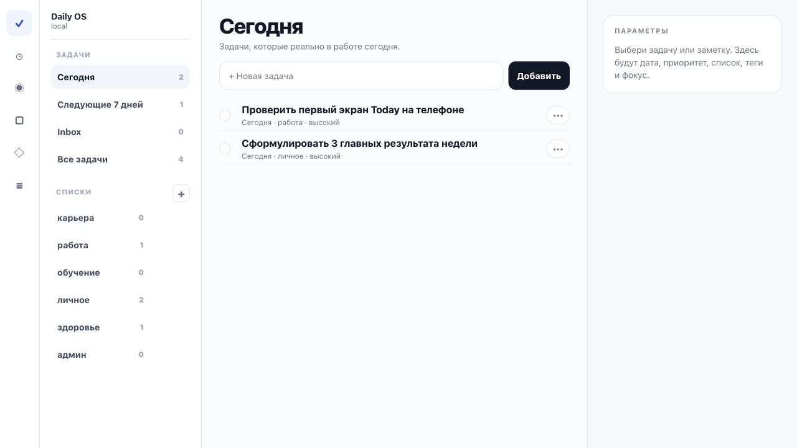

# Daily OS Foundation Reset Audit

Date: 2026-07-10

## Audit scope

Current local task-core flow at `http://127.0.0.1:4174/?fresh=88`:

1. Open Today.
2. Select an existing task.
3. Switch to Notes and select a note.
4. Inspect the current implementation boundaries and persistence path.

Primary user goal: open a calm task tracker, capture an item, understand where it was saved, edit it, complete it, and find it again.

Primary object for the first foundation slice: `task`. Notes are the second object. Habits, focus, projects, AI processing, and calendar are intentionally outside this slice.

## Evidence

### Step 1 — Today list



Health: partially working.

Strengths:

- The four-column task-tracker layout is calmer than the previous dashboard.
- System filters and user lists are visually separated.
- The center pane has one clear primary object: a task list.

UX risks:

- The empty inspector permanently reserves a large part of the viewport before an object is selected.
- Module icons are text glyphs rather than a consistent icon system and have weak accessible names.
- List edit/delete actions are separate permanent controls instead of one contextual menu.
- The app still contains the complete legacy `.app-shell` underneath the new `.simple-app`.

### Step 2 — Select a task

Health: structurally present, visually unverified because the browser screenshot command timed out after selection.

Observed behavior:

- Selecting a task opens date, priority, list, status, tags, and focus controls.
- Controls are rendered by the simple shell but depend on the same global state and render loop as the legacy application.
- The right pane is a full form rather than progressive task details, so frequent and rare properties have equal visual weight.

### Step 3 — Switch to Notes and select a note

Health: broken.

Observed behavior:

- The Notes list opens correctly.
- The right inspector still shows the previously selected task.
- Clicking the visible note did not replace the task inspector during the audit.
- `setSimpleModule()` clears `selectedTaskId` for most modules, but the rendered state and browser behavior are not consistently aligned.

### Step 4 — Implementation integrity

Health: high risk.

Confirmed structural problems:

- `public/index.html` contains two complete application shells: `.simple-app` and `.app-shell`.
- `public/app.js` is 3,619 lines and owns both products, rendering, persistence, AI flows, focus audio, and all interactions.
- `public/styles.css` is 5,565 lines with many historical `.app-shell` override layers plus the new shell appended at the end.
- The simple shell is hidden/shown through auth-dependent CSS instead of being the single application structure.
- Task interactions are split between the simple-shell listener and the legacy global body listener, which makes ownership and debugging harder than necessary.

## Accessibility risks

- Rail buttons expose glyphs such as `✓`, `◷`, and `□` as their accessible names instead of meaningful Russian labels.
- Several icon-only actions rely on `title` and tiny targets; keyboard focus order and visible focus need direct testing.
- Permanent inspector space reduces responsive reflow and zoom resilience.
- Screenshot evidence alone cannot verify keyboard navigation, screen-reader announcements, contrast ratios, or focus restoration after dialogs.

## Product decision

Do not continue adding features to the current dual-shell implementation.

Keep:

- Vanilla HTML/CSS/JS and the existing server simplicity.
- `saveState()` with localStorage and Supabase synchronization.
- Existing normalized task, note, list, and audit-log data where compatible.
- The visual direction of the current simple shell: light, restrained, list-first.

Remove from the foundation path:

- The legacy `.app-shell` and its screen-specific rendering from the visible runtime.
- Dashboard blocks, day timeline, Hero Journey, focus audio, habits, and AI processing from the first tracker slice.
- Permanent empty inspector.
- Text-symbol icons and duplicated navigation concepts.

## Target foundation architecture

```text
Module rail
  Tasks
  Notes

Task sidebar
  Today
  Next 7 days
  Inbox
  All tasks
  User-created lists

Main pane
  Title + search
  Inline composer
  Dense task/note rows

Context pane
  Closed when nothing is selected
  Task or note detail when selected
  Drawer on narrow screens
```

## First implementation slice

One acceptance flow only:

1. Create a user list.
2. Add a task to that list.
3. Open the task and change date, priority, tags, and list.
4. Complete and restore the task.
5. Search and reopen it.
6. Reload and confirm local/Supabase persistence.
7. Create a note, edit it, and see exactly where it is stored.

Every visible control in this slice must work. Anything outside the slice stays hidden, not mocked.

## Later slices

1. Habits as a separate module.
2. Focus timer and sound as a separate companion surface.
3. AI inbox with an explicit classification result and audit trail.
4. Week planning.
5. Projects and Hero Journey.
6. Read-only calendar integration.

## Verification gate for implementation

- No horizontal overflow at desktop and mobile widths.
- Inspector hidden when no object is selected.
- One application shell in the visible runtime.
- No English/Russian mixing in user-facing controls.
- Create/edit/complete/restore/search/reload flow passes.
- `node --check` and `npm run check` pass.
- Browser screenshots captured for empty, selected-task, selected-note, and mobile states.
